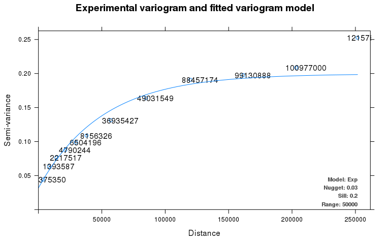

Ensemble Spatiotemporal Mixed Models for Exposure Estimation
================

sptemExp: a R package for spatiotemporal exposure estimation
------------------------------------------------------------

##### Lianfa Li (Email: <lspatial@gmail.com>)

It is an ensemble spatiotemporal modeling tool with constrained optimization and also provides the functionality of grid mapping of air pollutants and parallel computing.

Specifically, it includes the following functionality:

-   Extraction of covariates from the satellite images such as geoTiff and nc4 raster (e.g NDVI, AOD, and meteorological parameters);
-   Generation of temporal basis functions to simulate the seasonal trends in the study regions;
-   Generation of Thiessen polygons and spatial effect modeling;
-   Ensemble modeling for spatiotemporal mixed models, supporting multi-core parallel computing;
-   Integrated prediction with or without weights of the model's performance, supporting multi-core parallel computing;
-   Constrained optimization to interpolate the missing values;
-   Generation of the grid surfaces of air pollutant concentrations at high resolution;
-   Block kriging for regional mean estimation at multiple scales.

### Extraction of the covariates from satellite images

The following codes show the functions, extractVTIF and extractVNC4 to obtain the values for the subject locations with their timeline from GEoTiff (left) and BC4 (right) image files.

``` r
data("gtifRst","samplepnt")
tvals=sptemExp::extractVTIF(samplepnt,gtifRst)
par(mfrow=c(1,2),mar=c(4,4,1,1))
raster::plot(gtifRst)
raster::plot(samplepnt,add=TRUE)

nc4File=file.path(system.file(package = "sptemExp"), "extdata", "ancdata.nc4")
ncin0=ncdf4::nc_open(nc4File)
extRes=sptemExp::extractVNC4(samplepnt,ncin0,"TLML")
raster::plot(extRes$img)
```


``` r
print("geotiff values:")
```

    ## [1] "geotiff values:"

``` r
print(tvals[c(1:5)])
```

    ## [1] 441 484 268 344 324

``` r
print("nc4 values:")
```

    ## [1] "nc4 values:"

``` r
print(extRes$val[c(1:5)])
```

    ## [1] 277.6917 277.4444 277.2130 277.4444 277.2130

### Generation of the temporal basis function

You can use the function, getTBasisFun to extract the temporal basis functions (usually the first two principle components).

``` r
data("shdSeries2014")
#Extract the temporal basis functions 
result=sptemExp::getTBasisFun(shdSeries2014,"siteid","date","obs",df=8,n.basis=2)
#Plot the results 
par(mfrow=c(1,2),mar=c(4,4,1,1))
plot(result$date,result$pv1,type="l",xlab="Date",ylab="1st Temporal Basis Function")
plot(result$date,result$pv2,type="l",xlab="Date",ylab="2nd Temporal Basis Function")
```


### Generation of the Thiessen polygons for spatial effect modeling

We can generate the Thiessen polygons using the spatial points and border map. The function, tpolygonsByBorder is designed for this.

``` r
data("samplepnt","prnside")
x=samplepnt
sidepoly=prnside
par(mar=c(1,1,1,1))
tpoly=sptemExp::tpolygonsByBorder(x,sidepoly)$tpolys
raster::plot(samplepnt,add=T)
```


### Ensemble modeling for spatiotemporal mixed models, supporting multi-core parallel computing

The base spatiotemporal mixed models can be trained using the bootstrap datasets with support of multiple cores. The following examples illustrate the use of the function, parSpModel to train 12 models and the trained models are saved in the appointed model path. In practical application, you can train more models like 80 or more to get better performance.

``` r
#Set the temporary path to save the models and their performance metrics: 
dPath=tempdir()
mPath=paste(dPath,"/models",sep="")
unlink(mPath,recursive = TRUE,force=TRUE)
dir.create(mPath)

#Load the dataset of Shandong PM2.5 
data("trainsample","bnd")

#The formula where sx(rid, bs = "mrf", map =bnd) is spatial random effect.  You can add unstructured item and other items.  See R2BayesX. 
formulaStrs=c(paste('logpm25 ~ sx(rid, bs = "mrf", map =bnd)+sx(monthAv,bs="rw2")+sx(ndvi,bs="rw2") + sx(aod,bs="rw2") ','+sx(wnd_avg,bs="rw2")',sep=""))

trainsample$tid=as.numeric(strftime(trainsample$date, format = "%j"))
trainsample$logpm25=log(trainsample$pm25)
tids=c(91) # the day of year for 2014 

#Train the model using 2 cores and construct 12 models: 
sptemExp::parSpModel(trainsample,bnd,formulaStrs,tidF="tid",tids,c=1,nM=10,
           mPath,idF="siteid",dateF="date",obsF="pm25")
```

    ## [1] "t:  1"
    ## [1] "       model:1 of 10"
    ## [1] "       model:2 of 10"
    ## [1] "       model:3 of 10"
    ## [1] "       model:4 of 10"
    ## [1] "       model:5 of 10"
    ## [1] "       model:6 of 10"
    ## [1] "       model:7 of 10"
    ## [1] "       model:8 of 10"
    ## [1] "       model:9 of 10"
    ## [1] "       model:10 of 10"

    ##           used  (Mb) gc trigger  (Mb) max used  (Mb)
    ## Ncells 2476026 132.3    3886542 207.6  3886542 207.6
    ## Vcells 4876409  37.3   13681044 104.4 21376203 163.1

Check the performance (rSquared and rmse) of every model and the total performance.

``` r
#Check the performance of everty model
mfile=paste(dPath,"/models/t_",tids[1],"_metrics.csv",sep="")
models_metrics=read.csv(mfile,row.names = NULL)
knitr::kable(models_metrics,caption="Performance of every model by bootstrap aggregation")
```

|  imodel|          r2|       rmse|
|-------:|-----------:|----------:|
|       1|   0.6819686|   72.36493|
|       2|   0.6061918|   91.02627|
|       3|  -1.3405669|  104.66065|
|       4|   0.7514786|   74.78705|
|       5|   0.5182634|   78.67102|
|       6|   0.7625737|   76.76758|
|       7|   0.6832513|   76.58048|
|       8|   0.5355187|   76.97414|
|       9|   0.6825552|   74.83755|
|      10|   0.5372067|   73.95257|

``` r
#Check the total performance  
mtfile=paste(dPath,"/models/t_",tids[1],"_total_metric.csv",sep="")
t_metrics=read.csv(mtfile,row.names = NULL)
knitr::kable(t_metrics,caption="Total performance by  bootstrap aggregation")
```

|  tid|         r2|      rmse|
|----:|----------:|---------:|
|    1|  0.6673462|  17.05729|

### Integrate the predictions with or without weights of the model's performance

Using the models trained in the above step to make the predictions for the new dataset covering Shandong Province. Here we just use the 2000 cells but you can set the value to be all the cells.

``` r
#Set the output path of the predictions: 
prePath=paste(dPath,"/preds",sep="")
dir.create(prePath)

#Load the prediction dataset of covariates 
amodelPath=paste(dPath,"/models/t_",tids[1],"_models",sep="")
data("shd140401pcovs","bnd")
shd140401pcovs_part=shd140401pcovs[c(1:2000),]

#cols lists the field names of covariates to be used in the models. Then call parATimePredict to implement parallel predictions (the argument, c is the core number)
cols=c("aod","ndvi","wnd_avg","monthAv")
sptemExp::parATimePredict(amodelPath,newPnts=shd140401pcovs_part,cols,bnd=bnd,c=2,prePath,idF="gid",ridF="rid")
```

    ##           used  (Mb) gc trigger  (Mb) max used  (Mb)
    ## Ncells 2484700 132.7    3886542 207.6  3886542 207.6
    ## Vcells 5222961  39.9   13681044 104.4 21376203 163.1

Get the weighted averages by the function, weiA2Ens. You can also get the simple averages (not weighted) by the function, noweiAvg.

| id   | date |       mean|  StandardDev|   Variance|
|:-----|:-----|----------:|------------:|----------:|
| 1997 | 1997 |  101.59554|     9.172452|   84.13388|
| 1996 | 1996 |  105.31300|    10.413283|  108.43646|
| 1991 | 1991 |   98.93103|     9.055528|   82.00260|
| 1988 | 1988 |   99.76707|     8.554652|   73.18207|
| 1987 | 1987 |  108.80448|    12.720603|  161.81375|

### Constrained optimization to interpolate the missing values

Use the function of constrained optimization, inter2conOpt to get the values for the missing items.

``` r
data("allPre500","shdSeries2014")

#Get the temporal basis functions to be used in constrained optimization 
season_trends=sptemExp::getTBasisFun(shdSeries2014,idStr="siteid",dateStr="date",
                           valStr="obs",df=10,n.basis=2,tbPath=NA)
season_trends$tid=as.numeric(strftime(season_trends$date, format = "%j")) 

#Constrained optimization 
allPre_part_filled=sptemExp::inter2conOpt(tarPDf=allPre500[c(1:6),],pol_season_trends=season_trends,ncore=2)
```

    ## [1] "1 of 3"
    ## [1] "2 of 3"
    ## [1] "3 of 3"

``` r
knitr::kable(allPre_part_filled[c(1:6),],caption="")
```

|     |         d1|       d10|       d20|       d32|       d41|       d51|       d60|       d69|       d79|       d91|      d100|      d110|      d121|      d130|      d140|      d152|      d161|      d182|      d191|      d201|      d213|      d222|      d232|      d244|      d253|      d263|      d274|      d283|      d305|      d314|      d324|      d335|      d344|      d354|
|-----|----------:|---------:|---------:|---------:|---------:|---------:|---------:|---------:|---------:|---------:|---------:|---------:|---------:|---------:|---------:|---------:|---------:|---------:|---------:|---------:|---------:|---------:|---------:|---------:|---------:|---------:|---------:|---------:|---------:|---------:|---------:|---------:|---------:|---------:|
| 6   |  122.85424|  89.42742|  62.66390|  45.48924|  46.27284|  59.29426|  76.65560|  92.13597|  98.34205|  86.34609|  72.97928|  61.56609|  54.89888|  52.80087|  51.46472|  48.36195|  46.35885|  43.89639|  41.13629|  36.09612|  30.13036|  28.17422|  26.31104|  22.87484|  21.92161|  23.46074|  28.94409|  35.81034|  50.41806|  56.83202|  61.32039|  64.26901|  72.87738|  94.02896|
| 7   |   65.19155|  51.40158|  39.46674|  31.30001|  32.64243|  41.49334|  53.07626|  63.62694|  68.39269|  61.54400|  53.68353|  47.44825|  44.38368|  43.37936|  42.09418|  39.16380|  37.37985|  36.09319|  34.56814|  31.14601|  26.53710|  24.88078|  23.26449|  20.39421|  19.48162|  20.40667|  24.18721|  28.92508|  38.12440|  41.45793|  43.20061|  44.30038|  49.05572|  60.49184|
| 8   |   87.41588|  64.25040|  45.52331|  33.40262|  34.08075|  43.62874|  56.33073|  67.68494|  72.30572|  63.67505|  54.02390|  45.83318|  41.10738|  39.61352|  38.59030|  36.21993|  34.70157|  32.93625|  30.94682|  27.24229|  22.79642|  21.32334|  19.91623|  17.33256|  16.60382|  17.72342|  21.75990|  26.81125|  37.44756|  42.02812|  45.15633|  47.20269|  53.37143|  68.48499|
| 9   |   91.09619|  69.27261|  51.03000|  38.88040|  40.09278|  51.14976|  65.74366|  78.90658|  84.54659|  75.23790|  64.69720|  55.98810|  51.24876|  49.72556|  48.34960|  45.18748|  43.21364|  41.35816|  39.22188|  34.91793|  29.47569|  27.60244|  25.79472|  22.52767|  21.55098|  22.79490|  27.51293|  33.41281|  45.37553|  50.15282|  53.09241|  54.98507|  61.54570|  77.46636|
| 10  |  128.92694|  91.00578|  61.56515|  43.19569|  43.52050|  55.94016|  72.61539|  87.36842|  93.00097|  80.88795|  67.54126|  55.96588|  48.99459|  46.83157|  45.72459|  43.13313|  41.41539|  38.92155|  36.16997|  31.41676|  26.01821|  24.30399|  22.68583|  19.66038|  18.86443|  20.35637|  25.50445|  31.97014|  46.16866|  52.76651|  57.70222|  60.98697|  69.79034|  91.62851|
| 11  |         NA|        NA|        NA|        NA|        NA|        NA|        NA|        NA|        NA|        NA|        NA|        NA|        NA|        NA|        NA|        NA|        NA|        NA|        NA|        NA|        NA|        NA|        NA|        NA|        NA|        NA|        NA|        NA|        NA|        NA|        NA|        NA|        NA|        NA|

### Show the grids of concentration estimated

Generate the grid images of concentrations estimated.

``` r
data("spointspre","countylayer")
praster=sptemExp::points2Raster(spointspre,"d91")
dtStr=as.character(as.Date(91,origin=as.Date("2014-01-1")))
title=expression("PM"[2.5]*" Concentration Estimated")
#raster::plot(praster,col=terrain.colors(255),main=title,xlab=paste("Shandong Province, China (",dtStr,")",sep=""))
par(mar=c(4,4,1,1))
breakpoints = c(0,50,100,200,350,600)
colors=sptemExp::colorCusGrinf(breakpoints,c("darkgreen","yellow","darkred"))
raster::plot(praster,breaks=breakpoints,col=colors,
     main=title,xlab=paste("Shandong Province, China (",dtStr,")",sep=""))
```


### Block kriging for regional mean estimation at multiple scales.

The function, getTidBKMean is for generation of the regional krged means, supporting parallel compution.

``` r
data("spointspre","countylayer")
tarF="d91" # target variable to be kriged 
regionName="NAME_3"
bkRes=sptemExp::getTidBKMean(spointspre,countylayer,regionName,tarF,2)
```



    ## [1] "pcores:2"

``` r
# In the functions, the variogram is automatically fitted using autovariogram in automap package. 
```

Show the result of the regional kriged means of PM2.5 concentration across the study region.

``` r
# The output from the above step has bkm_fill is the regional kriged estimate.  
bkRes=bkRes[!is.na(bkRes$bkm_fill),]
levels=c(30,60,100,150,250)
cr=sptemExp::colorGrinf(bkRes$bkm_fill,levels,colors=c("darkgreen","yellow","darkred"))
par(mar=c(1,1,1,1))
title=expression("Regional Block Kriged PM"[2.5]*" Concentration Estimated")
raster::plot(bkRes,col =cr$cols[cr$index],main=title)
legend("bottomright", fill =cr$cols, legend = cr$levels,col =cr$cols, cex=1,bty="n",bg="n")
```


